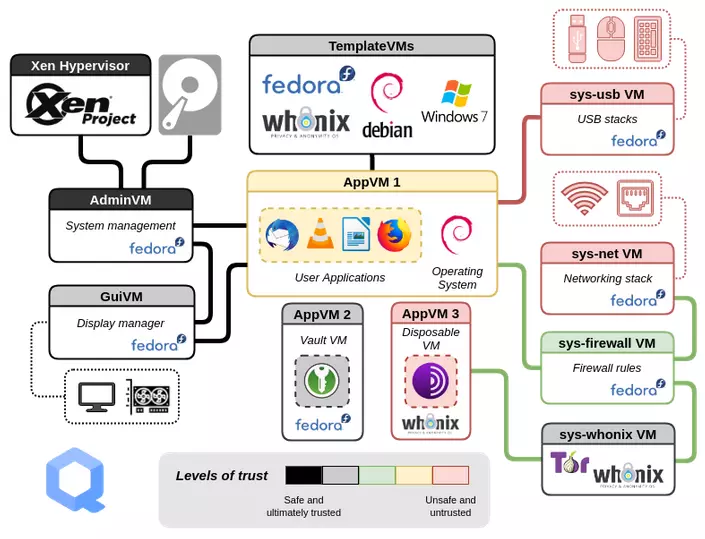

# -Opsec 백서 한국어판-

---

<b>0. 익명성, 항상 침목과 자신과의 비밀을 존중, 실수 하지 않기, 무감정 상태 유지 
1. 노트북 또는 SBC, 기타 서브 컴퓨터 사용 (자신의 컴퓨터 절대 사용금지)
2. 공용 와이파이 사용, 노트북 Aircard 사용 또는 유료 VPN 이용
3. Windows 사용 금지 (Qubes, Whonix + Kali, Tails 사용)
4. "영어대소문자, 숫자, 특수기호"가 모두 포함된 16자리 이상 패스워드 사용
5. 무료 VPN 사용 금지, 유료 VPN 사용 (Mullvad, Proton, Tor)
6. 불법 행위를 하는 경우 소셜 미디어에 게시하거나 사진, 등을 찍는 흔적을 남지 않기.
7. 파일 내려 받을때 반드시 VirusTotal로 의심스러운 파일을 검사
8. 암호화 알고리즘이 사용된 VeraCrypt로 하드 암호화 (BitLocker 절대 사용 금지)
9. 프로그램 실행전 sandboxie 통한 가상화 사전 프로그램 실행
10. OS, VM 설치 할땐 암호화된 저장매체에 이용 (Nitrokey, Yubikey)
11. 2FA/MTA 구글 OTP 사용 금지 Authy 또는 Aegis OTP 사용
12. 암호 기록시 BitWarden 이용 
13. 하드, 등 기억장치를 빠르게 날릴수 있는 버튼 설정</b>

## Opsec 백서 2022 한국어 (made by anonmoinx)

[1. 기기 및 운영체제](#기기-및-운영체제)

[2. 저장 매체 및 암호화](#저장-매체-및-암호화)

[3. VPN](#VPN)

[4. 파일 업로드](#파일-업로드)

[5. 비트코인 거래시](#비트코인-거래시)

[6. 대화 매체](#대화-매체)

[7. 1회성 혹은 임시 이메일](#1회성-혹은-임시-이메일)

[8. 이중 인증](#이중-인증)

[9. 압수 수색 영장](#압수-수색-영장)

[10. 수사 시나리오](#수사-시나리오)

--- 
  
## 네트워크 

[IP 주소]

 
IP 주소는 'whois' 조회를 통해 누가 소유하는지 확인할 수 있습니다.

IP 주소 관리하는 곳에서 IP 주소를 위도/경도 위치로 전환할 수 있는 지리적 위치 데이터베이스가 있습니다.

일반적으로 지리적 위치는 최소한 해당 IP 주소가 현재 연결된 ISP 데이터 센터로 연결됩니다.

일반적으로 주거용 인터넷 소비자인 경우 해당 주소를 소유한 ISP를 볼 수 있고

연방 정부는 주어진 시간에 해당 주소를 임대한 회사에 물어보기만 하면

주거지의 특정 아파트 번호로 연결될 수 있기 때문 입니다.

  
---

## 기기 및 운영체제

<b>자신의 컴퓨터는 절대 사용하면 안될것</b>

노트북 또는 X86 지원되는 SBC 사용한다.
 
 
ODYSSEY - X86J4105 (이 제품은 실제로 Qubes를 구현해낸 x86 SBC이다.)

(https://www.seeedstudio.com/blog/2020/05/26/qubes-os-security-oriented-operating-system-and-run-qubes-os-on-odyssey-x86j4105/)

ODROID - H3+ (이 제품은 최근이 나온 x86모델중 사양이 가장 좋다.)

이외에도 라떼판다, RockPI 등이 있다.
 
노트북은 중고 제품 써도 된다. 그리 좋은 사양은 필요 없다.

일반적으로 공용 와이파이를 사용하거나 AirCard 사용하는것이 좋다.
 
 
권장 OS는 Whonix, Qubes, Tails 이렇게 3가지 이다.

보통 VM를 통해서 Whonix+Kali 환경을 사용하는 것을 추천한다.

추가적으로 MAC주소 노출에 민감하다면 Qubes+Whonix 환경을 세팅하면된다.

Qubes가 유일하게 MAC 주소 익명화를 제공하기 때문이다.

윈도우는 절대 사용하지 말것.
 

---
## 저장 매체 및 암호화
[저장매체]

Nitrokey Storage 2 (오픈소스 : 개인정보 수집을 하지 않기 때문) 

yubikey (오픈소스가 아님) 

기타 5 NFC가 활성화된 Bitwarden 

 
  
[디스크 암호화]
  

veracrypt 통해 디스크를 "완전한 암호"으로 암호화 한다.

 
**안드로이드 (~2015)**

'안전한 비밀번호'로 잠금 설정 후

(기기마다 다름) 보안 > 디바이스 암호화

 
**안드로이드 (2016~)**

'안전한 비밀번호'로 잠금 설정 후

(기기마다 다름) 보안 > 보안 시작 > 전원을 켤 때마다 설정

 
**아이폰 (3GS~)**

'안전한 비밀번호'로

잠금 설정

하지만 컴퓨터나 휴대폰을 켜져 있는 동안 기기의 "메모리(RAM)에 비밀번호가 임시 저장"돼 있어,

"위기 순간" 이 오면 전원을 내린 후 RAM에 있는 것들이 날아갈 때까지 시간을 끄는 것 이 생존 가능성을 높이는 길입니다...
  
  
---
  
## VPN

mullvad VPN, Protonvpn 사용 한다. (무료 VPN은 절대 사용하면 안된다.)

mullvad VPN은 모든 VPN 중 유일하게 정보 유출이 된 기록이 없다. 

https://mullvad.net/en/blog/2022/6/22/vpn-server-audit-found-no-information-leakage-or-logging-of-customer-data/

 
(mullvad VPN는 제 3자를 통해 구입 하는것이 더욱 안전)

https://digitalgoods.proxysto.re/

 
실수로 잠시 동안 VPN을 사용하지 않으면

때에 따라 다르지만, VPN을 켜고 웹사이트를 탐색 중

"극비 익명 전자 메일 주소" 계정에 로그인한 기록이 브라우저 쿠키가 남을 수 있다.

그러고 나서 VPN 연결을 끊으면 브라우저가 이 서버에 HTTP 요청하게 된다.

  
즉, 쿠키는 똑같이 해당 서버의 웹 사이트에서 보내지게 된다.

그들은 당신의 쿠키가 독일에서 나온 것을 보았고, 그 다음에는 캐나다, 등 기타 국가

그렇게 돌고돌아 당신의 "진짜 위치"가 어디에 있는지 볼수 있게 되는것이다.

 
실크로드의 다크웹 마약 거래 플랫폼을 운영하던 사람이,

실제 IP 주소 환경에서 IRC 계정에 로그인한 것 때문에 잡힌 것이다.

그가 다크웹에서 그렇게 유명한 사업을 운영하고 있었기 때문에, 그의 계정들은 면밀히 감시되었고

그가 한 번 실수로 인해 그의 진짜 IP 주소를 유출시킨 것이 그를 잡는데 도움이 되었다.

 
  VPN을 사용하지 않고 모든 요청을 거부하는 <b>킬 스위치(Always On VPN)</b> 수단이 있어야 한다.

터널링 절차 때문에 OpenVPN을 사용하면 쉽다. 필수는 아니지만 실제 IP를 유출하고 네트워크를 노출하지 않는것으로 적극 권장한다.

또한 적절한 방화벽 규칙을 통해 네트워크에 연결하고 해당 VPN 호스트를 통해서만 인터넷에 연결할 수 있도록 구성한다.

 
  <b>최적의 솔루션은 OpenVPN + Mullvad + Tor</b>
  
  

---

## 파일 업로드
 
대용량 CDN 파일 전송 (2주 무료) / 익명 이메일 사용

[Bunny CDN | Hop on the Fastest Content Delivery Network!]

(https://bunny.net)

 
익명 파일 업로더

[Anonymous File Upload]

(https://anonfiles.com/)

 
  
파일 바이러스 검사 (파일 내려받을때 검사 필수)

[VirusTotal]
(https://www.virustotal.com/gui/home/upload)

---
  
## 비트코인 거래시

XHV 또는 XMR(모네로) 사용

 
[온라인 지갑]

Railgun Aztec(zk.money)와 SCRT
[Overview - Safe](https://gnosis-safe.io/)

 
[하드웨어 지갑]

[Ledger](https://shop.ledger.com/products/ledger-nano-x?r=8b49b9c6f1fe&tracker=checklist),
[Trezor](https://shop.trezor.io/?offer_id=10&aff_id=1181)
  
---
  
## 대화 매체

Nicegram (텔레그램) 이용 (자기 번호 절대 금지)

https://my.nicegram.app/login?lng=ko 

---
  
## 1회성 혹은 임시 이메일

Tutanota 

https://tutanota.com/ 

 
Protonmail 

https://proton.me/ 

 
가입 시 랜덤 아이디/패스워드 이용 (늘 사용하던건 금지) 

---
  
## 이중 인증 

SMS 기반 2FA, Google OTP 금지!! 

Authy 또는 Aegis OTP 사용

---
  
## 압수 수색 영장
  > 만약 경찰이 압수수색 영장을 들고 집에 들어온다면
> 

안드로이드

- 전원을 내립니다.
- 만약 화면을 보기 힘든 상황일 때 "전원 버튼 + 볼륨 내림 버튼 길게 홀드"하면 기기가 재부팅 되면서 비밀번호 없이 접근이 불가능해집니다.

아이폰

- 전원을 내립니다.
- 아이폰6s 까지: 전원 버튼 + 홈 버튼 홀드
- 아이폰7: 전원 버튼 + 볼륨 다운 버튼 홀드
- 아이폰8,X 이후: 볼륨 버튼 위 아래 한 번씩 짧게 누른 후 전원 버튼 홀드 (이해 안되면 검색)

윈도우

- 전원을 내립니다 (전원 버튼 홀드)
- (베라크립트 사용 시) 베라크립트 > 설정 > 단축키(Hot keys) > "강제 모두 제거, 캐시 지우기, 끝내기(Force Dismount All, Wipe Cache & Exit)" 단축키 미리 설정한 후 컴퓨터 켜져 있는 상태에서 들이닥치면 단축키 바로 사용하기!!!
랩톱(노트북)같은 경우 단순히 덮는 것만으로 제대로 락이 걸리지 않습니다. 시스템 종료를 습관화 합시다.

전원 꺼진 후 시간을 끌 수록 더 복구가 힘들어집니다.

법 지식도 알고 있어야 경찰의 편법에 넘어가 걸레될일 없습니다.

디지털 포렌식 당할 때
[https://youtu.be/f6rWwRVrRFo](https://youtu.be/f6rWwRVrRFo)

묵비권 행사하기
[https://youtu.be/oy41Q2VqrNw](https://youtu.be/oy41Q2VqrNw)

---
## 수사 시나리오

**최악의 시나리오: 경찰 수사**

경찰이 당신에게 연락하는 경우, 웬만해서는 경찰은 당신의 전화번호를 알지라도,

당신이 텔레그램이란 메신저를 통해

직접 아동청소년 음란물을 주고받았다는 증거, 아동청소년 음란물을 소지하고 있다는 증거 같이,
  
당신을 **유죄판결 내릴 수 있는 효력 있는 증거는 연락 당시 경찰이 가지고 있지 않을 가능성이 큽니다.**

이 상황에서 경찰 조무래기한태 쫄아서 다 자백해버린다면, 당신이 증거를 만들어준겁니다.

풀릴 수도 있는게 대부분인데...

그러니 다 자백해서 형량 낮출 생각 섣부른 판단 하지 마세요. 없었던 형량를 만들어낼 수 있습니다.

**대한민국 사법에는 무죄추정의 원칙, 증거재판주의가 있습니다.**

당신이 범죄를 저질렀다는 증거가 있어야 범죄자가 되지, 저지른 증거가 없다면 증거불충분으로 풀려나옵니다.

아래 유튜브 강의 영상 잘 숙지하고, 경찰에 대한 침착한 대응 기대합니다.

경찰서에서 전화가 온다면

[https://youtu.be/Oo0VF4tiL5A](https://youtu.be/Oo0VF4tiL5A)

디지털 포렌식을 당한다면

[https://youtu.be/f6rWwRVrRFo](https://youtu.be/f6rWwRVrRFo)

묵비권 행사

[https://youtu.be/oy41Q2VqrNw](https://youtu.be/oy41Q2VqrNw)

불법 수사 대비

[https://youtu.be/GPeEin-QIDI](https://youtu.be/GPeEin-QIDI)

[https://youtu.be/FI6Mhu48XuQ](https://youtu.be/FI6Mhu48XuQ)

[https://youtu.be/g9-3dy70I_M](https://youtu.be/g9-3dy70I_M)

[https://youtu.be/sg_1oPYAnUc](https://youtu.be/sg_1oPYAnUc)

나홀로 경찰•검찰 수사

[https://youtu.be/0CSki7kS80M](https://youtu.be/0CSki7kS80M)
